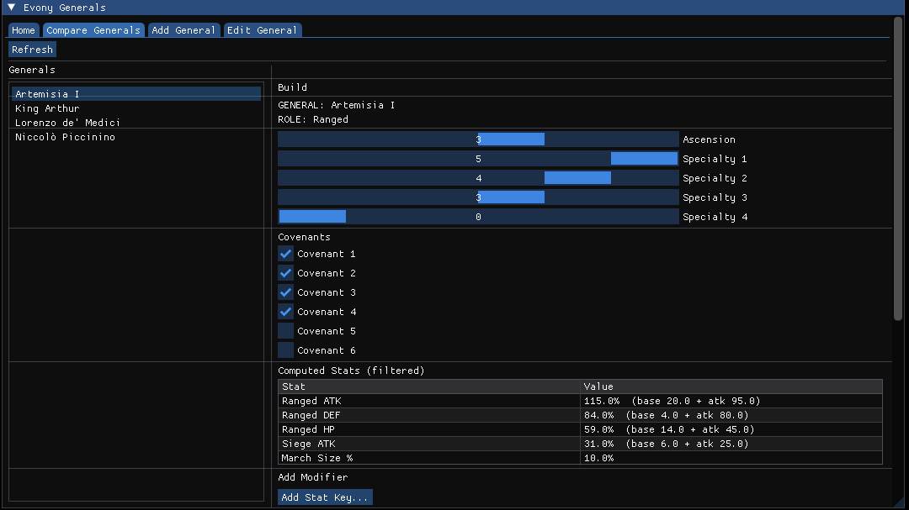
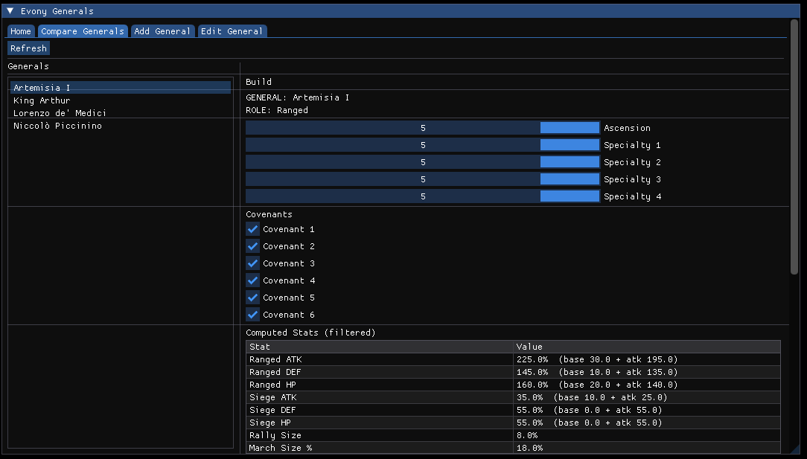
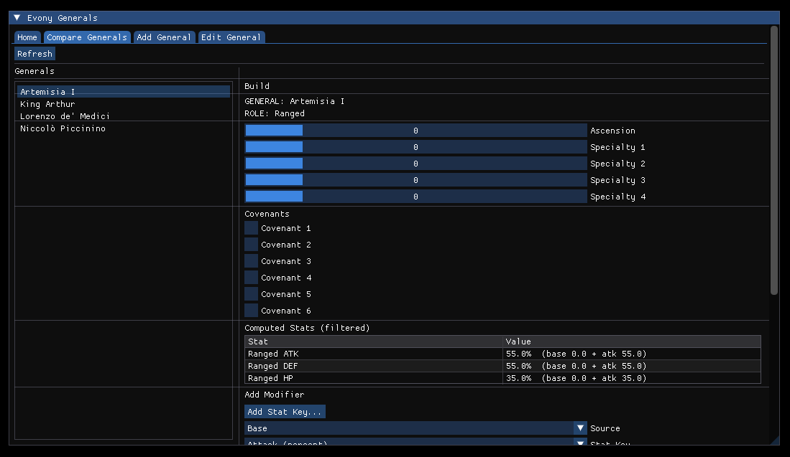
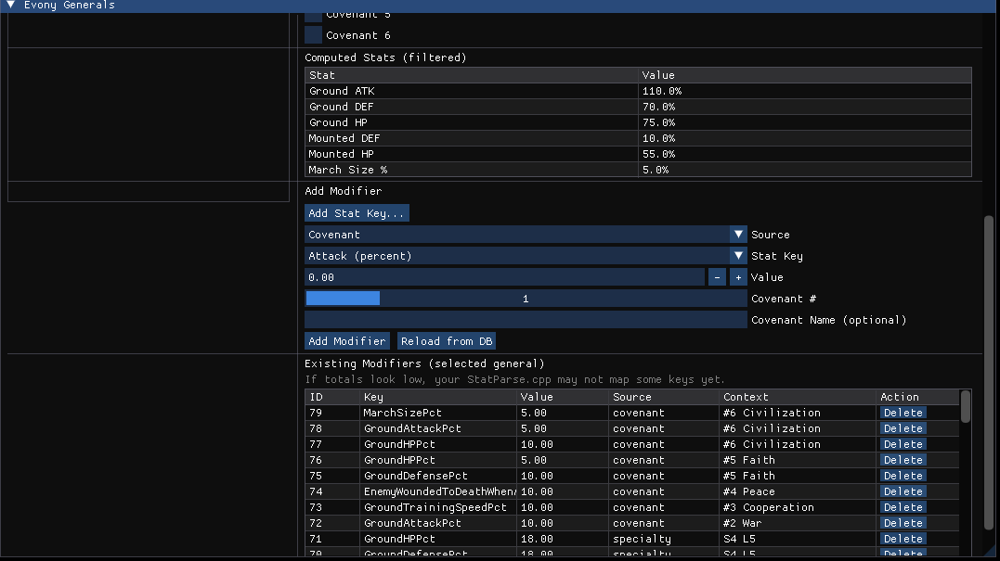
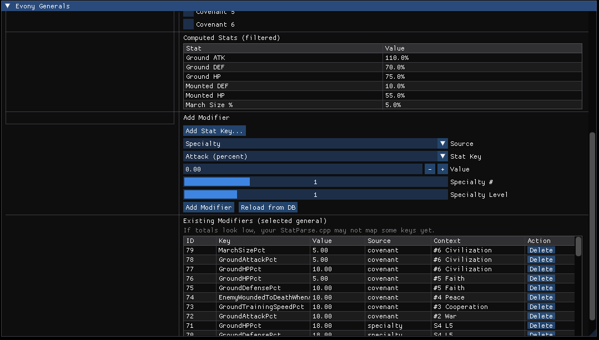
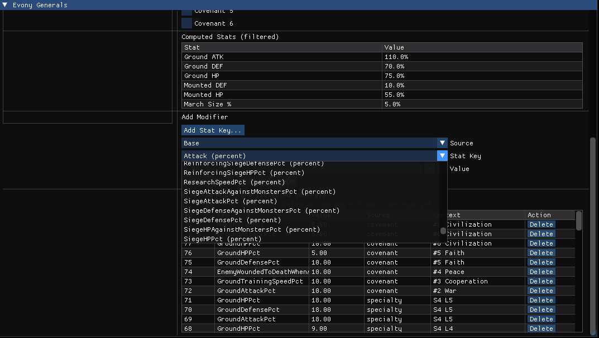
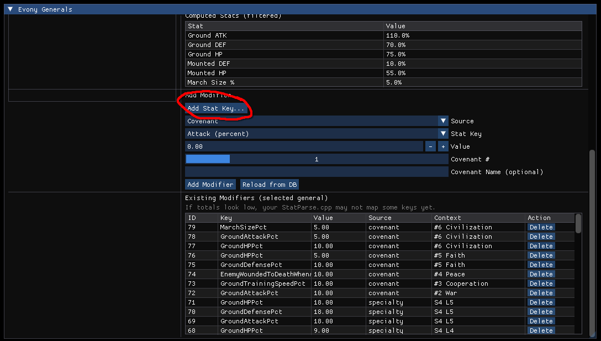

# Evony General Analyzer

> ⚠️ **Experimental / Vibe Coding / Learning Project**  
> This application is primarily **written by ChatGPT**, with guidance, architecture decisions, debugging, and Evony domain knowledge provided by **GitHub user `AHoskam`**.  
> The goal is experimentation and learning while building something genuinely useful.

---

## What This Project Is

**Evony General Analyzer** is a desktop GUI tool for analyzing **Evony: The King's Return** generals.

It lets you:
- Define generals in a local SQLite database
- Apply buffs from **base stats, specialties, ascension, and covenants**
- Toggle build options interactively
- See computed troop stats update in real time

This tool:
- ❌ Does **not** connect to the game
- ❌ Does **not** automate gameplay
- ✅ Is purely for theory‑crafting and planning

---

## Screenshots

### Compare / Analyze Generals (Main Screen)


---

### Fully Maxed Example


---

### Base / Empty Build


---

### Adding Modifiers — Covenants


---

### Adding Modifiers — Specialties


---

### Existing Modifiers List


---

### ⚠️ Add Stat Key (Advanced / Dev‑Only)


> **Important:**  
> The **Add Stat Key** button only inserts a key into the database.  
> **It will NOT affect calculations** unless the key is explicitly mapped in `StatParse.cpp`.  
> This exists for development and future expansion, not normal use.

---

## Current Feature Status

### ✅ Working
- Dear ImGui GUI
- SQLite persistence
- General selection
- Ascension & specialty sliders
- Covenant toggles
- Modifier add/remove
- Live stat recomputation

### 🚧 Planned / In Progress
- Automated stat‑key mapping
- Import generals from text files (UI button)
- Side‑by‑side general comparison
- Cleanup of experimental UI elements

---

## Building the Project

### Linux (Manjaro / Arch tested)

**Dependencies**
- C++17 compiler (`g++` or `clang`)
- `make`
- OpenGL
- GLFW
- SQLite3

```bash
git clone https://github.com/YOUR_USERNAME/evony-general-analyzer.git
cd evony-general-analyzer
make
./evony_generals
```

---

### Windows (Possible, Not Fully Tested)

The project should compile on Windows using:
- **MSYS2 + MinGW**, or
- **Visual Studio + vcpkg**

Required:
- C++17
- GLFW
- OpenGL
- SQLite3

Some Makefile or project adjustments may be necessary.

---

## Data Model Overview

- SQLite database (`evony.db`)
- Tables:
  - `generals`
  - `stat_keys`
  - `modifiers`
- Stats are computed through:
  - `Stat.h / Stat.cpp`
  - `StatParse.cpp`
  - `Compute.h`

Only stat keys explicitly mapped in code are included in calculations.

---

## Disclaimer

This is an **unofficial** fan project.  
Not affiliated with or endorsed by Top Games or Evony.

---

## Credits

- **AI Development:** ChatGPT (OpenAI)  
- **Human Direction & Implementation:** GitHub user **AHoskam**

Built with curiosity, persistence, and probably too much coffee.
