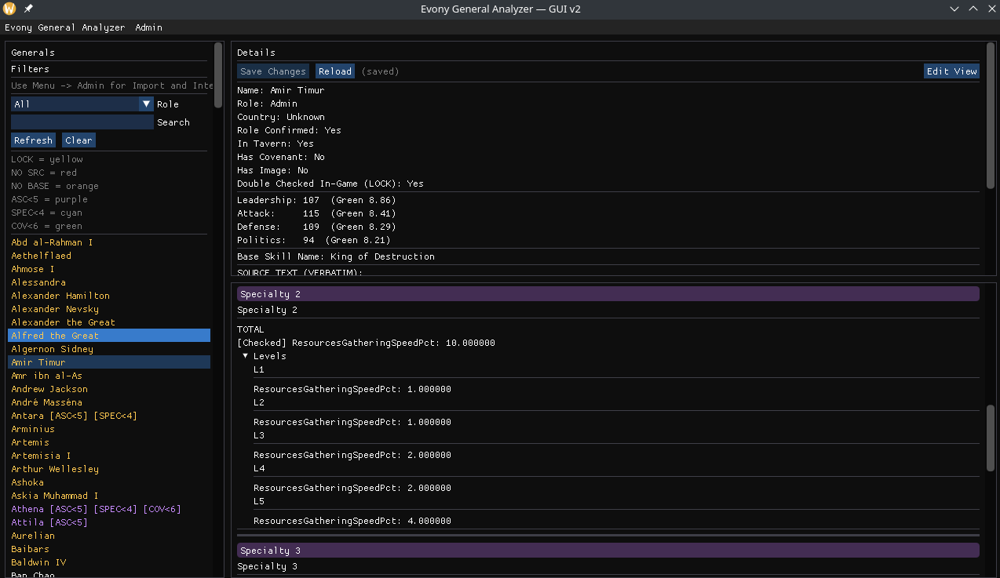
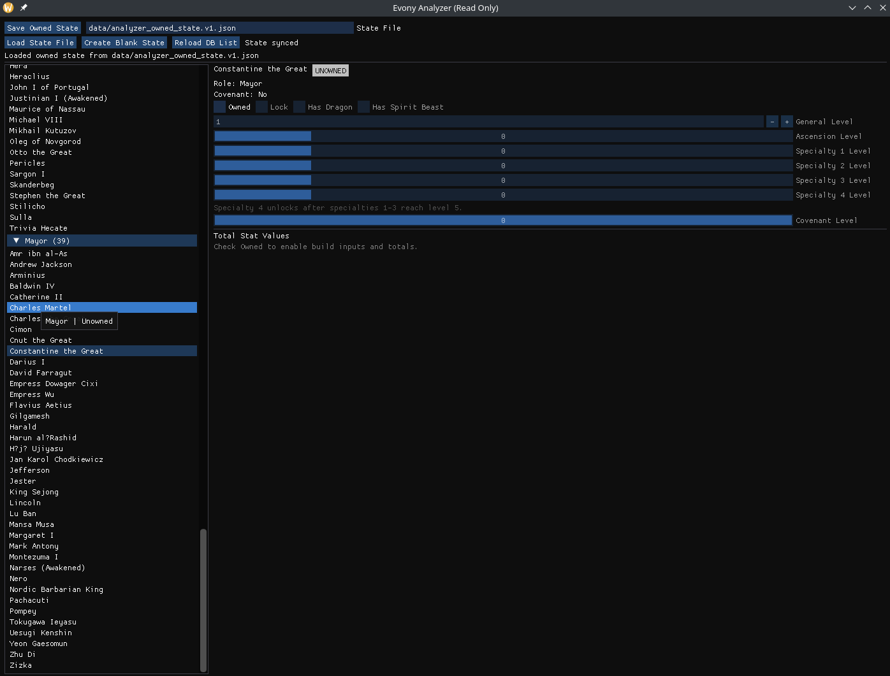
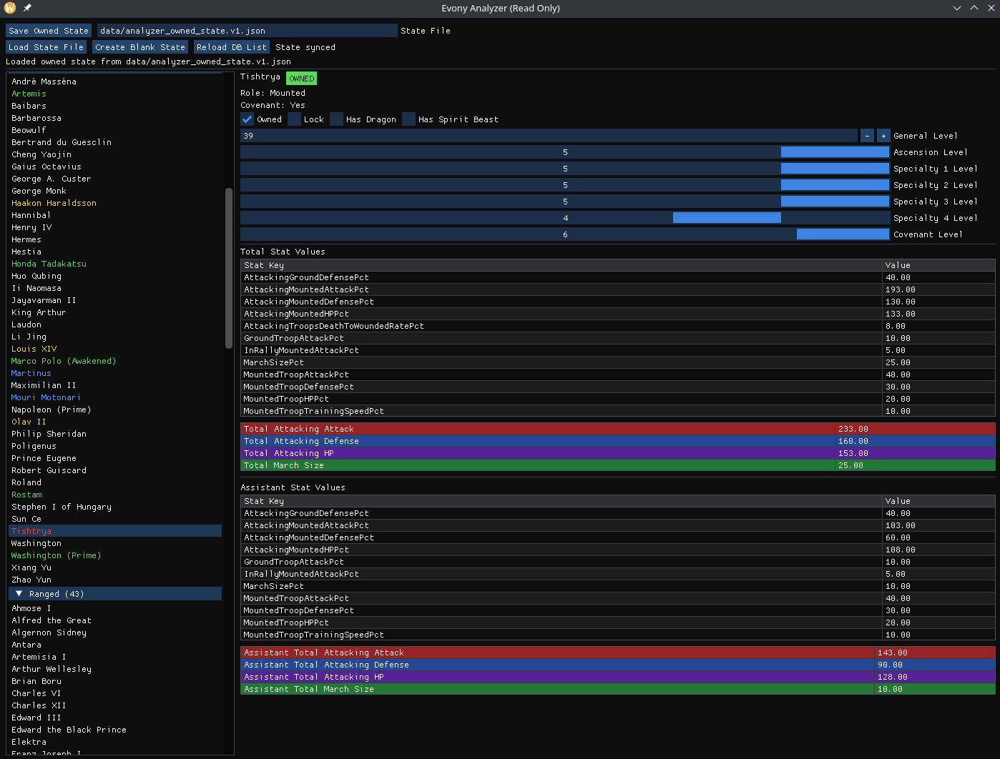

# Evony General Analyzer

Desktop tools for building and maintaining a local Evony general database, then analyzing owned generals with a separate read-only planner.

This repo currently centers on two apps:

- `evony_gui_v2`: the database editor, import/admin console, and verification workspace
- `evony_analyzer_ro`: the read-only analyzer for owned generals and build planning

There is also a CLI importer:

- `importer_v2`

This project is for local data entry, normalization, and theorycrafting. It does not connect to the game and does not automate gameplay.

## Current Repo Layout

- Active GUI editor: `src/main_gui.cpp`, `src/ui.cpp`, `src/model.cpp`, `src/db.cpp`
- Active analyzer: `src/analyzer/`
- Active importer: `src/importer/`
- DB admin / maintenance helpers: `src/db_admin.cpp`, `src/db_maintenance.cpp`
- SQLite schema: `sql/schema_v2.sql`
- Canonical stat key list: `data/canonical_keys.txt`
- Analyzer owned-state template: `data/analyzer_owned_state.template.json`
- Archived pre-v2 code: `archive/`

## What The GUI DB App Does

`evony_gui_v2` is the working database application. It is not just a viewer anymore; it is the main place to curate and verify the SQLite data.

Core responsibilities:

- Browse generals by name and role
- Edit general metadata such as role, country, tavern status, base skill, and covenant members
- Store source text used to build the record
- Manage portrait images stored directly in the database
- Edit stat occurrences across base skill, ascension, specialty, and covenant contexts
- Review unresolved imported stats from the pending tables
- Save changes transactionally and reload from the database
- Lock verified generals with `double_checked_in_game`
- Run importer preview/import from inside the app
- Audit and repair database integrity issues from inside the app

Important behavior:

- Opening the writable DB automatically applies the current `generals` migrations and syncs canonical stat keys from `data/canonical_keys.txt`
- Generals marked `double_checked_in_game=1` are treated as locked for editing/import protection
- The importer will not overwrite locked generals
- The analyzer only shows locked/checked generals

### GUI Editor Features

The GUI currently supports:

- Dirty-state protection with Save / Discard / Cancel prompts
- Read-only "pretty view" for in-game verification
- Full edit mode for metadata and stat occurrences
- Specialty editing, including handling total rows and split rows
- Covenant editing, including numbered covenant tiers
- Pending-key review for unmapped imported stats
- Image loading from an arbitrary file path or matching files in `data/GeneralImages`

### GUI Admin Tools

From the GUI menu, the admin tools currently cover:

- Import preview from `data/import` or another folder
- Full import run with summary/report output
- Post-import integrity audit
- Orphan-row repair for broken references
- Specialty repair helper that promotes singleton unchecked specialty L5 rows to TOTAL rows

## What The Analyzer App Does

`evony_analyzer_ro` is a separate read-only planner built on top of the verified database. It never writes to the SQLite DB.

Instead, it reads checked generals from the database and saves your ownership/build settings to a JSON state file.

Core responsibilities:

- Load only generals marked `double_checked_in_game=1`
- Track whether a general is owned
- Track build state per general:
  - general level
  - ascension level
  - specialty levels 1-4
  - covenant level
  - dragon or spirit beast selection
  - optional lock flag for owned records
- Compute total stats for the selected build
- Compute assistant-style totals separately
- Save and reload the owned-state JSON file

Analyzer behavior to know:

- The database is opened read-only
- Owned state is stored outside the DB
- Specialty 4 only unlocks after specialties 1-3 reach level 5
- Dragon and spirit beast are mutually exclusive
- The analyzer can start from a blank JSON file using the included template structure

Default state file path:

- `data/analyzer_owned_state.v1.json`

Template:

- `data/analyzer_owned_state.template.json`

## Import Pipeline

The importer consumes `.txt` files and updates the v2 database.

Current importer behavior includes:

- Creating or updating unlocked generals
- Skipping locked generals
- Resolving known stat keys through canonical keys and aliases
- Sending unknown keys to the pending tables for later review
- Writing import summary messages
- Moving processed files into imported/invalid destinations during a run

You can run imports either from the GUI admin menu or from the CLI binary.

## Build

The repo now supports both:

- the existing top-level `Makefile`
- a new top-level `CMakeLists.txt`

Dependencies:

- C++20 compiler
- `make`
- `sqlite3`
- `glfw3`
- OpenGL development libraries
- `pkg-config`

Build everything with `make`:

```bash
make
```

Build individual targets:

```bash
make gui
make importer
make analyzer
```

Produced binaries:

- `build/evony_gui_v2`
- `build/importer_v2`
- `build/evony_analyzer_ro`

### CMake Build

Dependencies are the same:

- C++20 compiler
- `cmake`
- `sqlite3`
- `glfw3`
- OpenGL development libraries
- `pkg-config` on Linux when CMake package configs are not installed

Configure:

```bash
cmake -S . -B cmake-build
```

Build:

```bash
cmake --build cmake-build -j
```

CMake-produced binaries:

- `cmake-build/evony_gui_v2`
- `cmake-build/importer_v2`
- `cmake-build/evony_analyzer_ro`

Optional switches:

```bash
cmake -S . -B cmake-build -DEVONY_BUILD_GUI=OFF
cmake -S . -B cmake-build -DEVONY_BUILD_ANALYZER=OFF
cmake -S . -B cmake-build -DEVONY_BUILD_IMPORTER=OFF
```

### Cross-Compile Windows From Linux

You can cross-compile Windows binaries from Linux with MinGW-w64, but you need:

- a Windows cross-compiler such as `x86_64-w64-mingw32-g++`
- Windows builds of dependencies for any targets you enable
  - `sqlite3` for all apps
  - `glfw3` and OpenGL import libs for `evony_gui_v2` and `evony_analyzer_ro`

The repo includes a MinGW toolchain file:

- `cmake/toolchains/mingw-w64-x86_64.cmake`

Example configure for the importer only:

```bash
cmake -S . -B cmake-build-windows \
  -DCMAKE_TOOLCHAIN_FILE=cmake/toolchains/mingw-w64-x86_64.cmake \
  -DEVONY_BUILD_GUI=OFF \
  -DEVONY_BUILD_ANALYZER=OFF \
  -DEVONY_BUILD_IMPORTER=ON
```

Then build:

```bash
cmake --build cmake-build-windows -j
```

If your Windows GLFW/SQLite packages install into a non-default prefix, pass that during configure:

```bash
cmake -S . -B cmake-build-windows \
  -DCMAKE_TOOLCHAIN_FILE=cmake/toolchains/mingw-w64-x86_64.cmake \
  -DCMAKE_PREFIX_PATH=/path/to/windows/deps
```

## Running

Run the GUI DB app:

```bash
./build/evony_gui_v2 --db data/evony_v2.db
```

Run the CLI importer:

```bash
./build/importer_v2 --db data/evony_v2.db --path data/import
```

Run the analyzer:

```bash
./build/evony_analyzer_ro --db data/evony_v2.db --state data/analyzer_owned_state.v1.json
```

Equivalent convenience targets exist:

```bash
make run_gui
make run_importer
make run_analyzer
```

## Data Files

Primary DB:

- `data/evony_v2.db`

Other important data paths:

- Raw import folder: `data/import`
- Canonical stat keys: `data/canonical_keys.txt`
- Analyzer owned-state template: `data/analyzer_owned_state.template.json`
- Backup DB snapshots: `data/backups/`
- General image folder used by the GUI helper: `data/GeneralImages/`

## Database Notes

The v2 schema is centered around:

- `generals`
- `stat_keys`
- `stat_key_aliases`
- `stat_key_transforms`
- `stat_occurrences`
- `pending_stat_keys`
- `pending_stat_key_examples`

The writable GUI opens the database with migrations and canonical-key sync. The analyzer opens the same database read-only.

## Screenshots

### Older System Screenshots

These images are from the older UI/workflow that the previous README was documenting:

- 
- 
- 
- 
- 
- 
- 

### New Program Screenshots

These images are from the newer apps in the current repo:

- GUI DB app: 
- GUI DB app: 
- Analyzer app: 
- Analyzer app: 
- Analyzer app: 

## Status

What is active today:

- GUI DB editor/admin app
- Read-only analyzer app
- CLI importer
- DB integrity audit/repair helpers
- Canonical stat-key sync
- Specialty/covenant-aware analyzer calculations

What is intentionally not part of the current workflow:

- Anything under `archive/`
- The old README-era assumption that there is only one app
- The old "base stats + specialties + covenants only" description of the project

## Disclaimer

Unofficial fan project. Not affiliated with or endorsed by Top Games or Evony.
